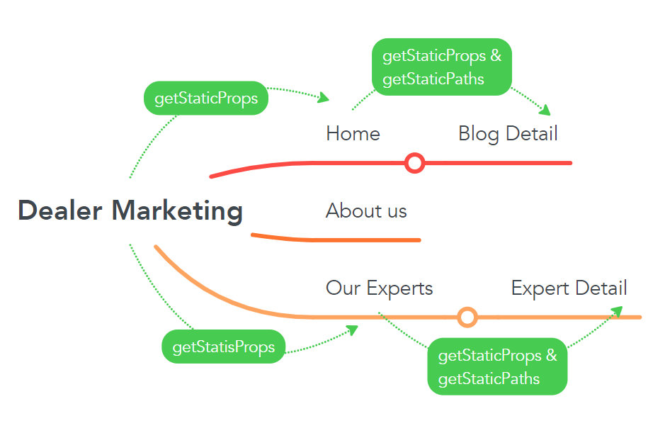

# OVERVIEW

- This document provides a detailed estimate of the Next.JS Practice. This practice creates a Dealer-Marketing app with goals that I can apply Next.js knowledge.

## FEATURES

- User can see blogs list
- User can see experts list
- User can search blog by title
- User can see blog details
- User can see expert details

# EXTRA FEATURES

- Party town
- Schema
- dangerouslySetInnerHTML

## TARGET

- Understand and apply getStaticProps and getStaticPath
- Unit test coverage should greater than 80%

## DESIGN

- [UI](https://www.dealermarketing.com/)

## TIMELINE

- Estimated time: (22/8/2022 - 30/8/2022) [7 working days](https://docs.google.com/document/d/1Z6lftn0NQNdCeZ4BgTOoaTBS9kBSNZv_awwHmY10o0U/edit#heading=h.b81umtm0t9oh)

## TEAM SIZE

- 1 dev

## TECHNICAL STACK

- NextJs
- React
- Storybook
- Jest - React testing lib
- CSS Modules
- Vercel

## EDITOR

- Visual Studio Code

## DEVELOP TOOLS

- Typescript
- husky, prettier, eslint

# PREREQUISITES

- Install pnpm **(Node.js is preinstalled)**

  ```
   On Linux or macOS:
    curl -f https://get.pnpm.io/v6.16.js | node - add --global pnpm
  ```

  ```
  On Windows (PowerShell):
   Invoke-WebRequest 'https://get.pnpm.io/v6.16.js' -UseBasicParsing -o pnpm.js; node pnpm.js add --global pnpm; Remove-Item pnpm.js
  ```

  ```
  Using npm:
  npm install -g pnpm
  ```

# WORKFLOW



# DEPLOYMENT

```
- App
https://dealer-marketing.vercel.app/

- Storybook
https://dealer-marketing-storybook.vercel.app/
```

# RUN

````Clone project:
  - git clone git@gitlab.asoft-python.com:thuong.buihoai/react-training.git
  - cd react-training
  - git checkout feature/nextjs-practice
  - cd dealer-marketing```

```create .env.development file:
  - NEXT_PUBLIC_ENDPOINTS=https://63183dc9f6b281877c66cbe0.mockapi.io
```
```- Install dependencies : pnpm install
- Run app: pnpm dev
- Open on web: http://localhost:3000/
- Run storybook: pnpm storybook
- View story book on web: http://localhost:6006/```
````
